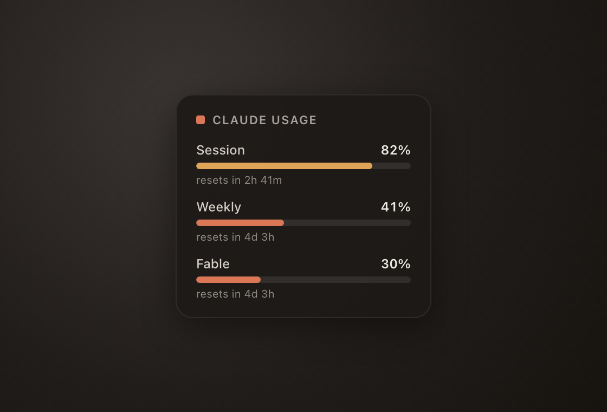

# Claude usage widget

A minimal macOS desktop widget that shows your Claude Code usage limits — **session**, **weekly**,
and **Fable** — right on your desktop, mirroring the `claude /usage` screen. Renders via
[Übersicht](https://tracesof.net/uebersicht/).

No claude.ai cookie, no third-party server, no telemetry. It reuses the login you already have from
the `claude` CLI and talks only to Anthropic's own hosts. **Read-only by default** — it never writes
to your Keychain (see [Token refresh](#token-refresh)).



<sub>Sample data. Bars turn amber past 75% and red past 90%.</sub>

## Requirements

- macOS
- [Übersicht](https://tracesof.net/uebersicht/) — `brew install --cask ubersicht`
- [Claude Code](https://claude.com/claude-code) installed and **logged in** (run `claude` once and sign in)
- `python3` — comes with the Xcode Command Line Tools; if `python3 --version` fails, run `xcode-select --install`

## Install

```sh
git clone https://github.com/laurensvandijk/claude-usage-widget.git
cd claude-usage-widget
./install.sh
```

`install.sh` checks that Übersicht and your Claude Code login are present, symlinks this folder into
Übersicht's widgets directory (as `claude-usage`), tests the data fetch, and restarts Übersicht.
The widget appears top-right by default.

If a firewall (LuLu / Little Snitch) prompts, **allow** Übersicht's helper to reach
`api.anthropic.com` and `platform.claude.com`. Those two hosts are all the widget contacts.

### Manual install

```sh
ln -sfn "$PWD" "$HOME/Library/Application Support/Übersicht/widgets/claude-usage"
open -a "Übersicht"
```

## How it works

- `claude-usage.py` reads the Claude Code OAuth token from the macOS login Keychain
  (`Claude Code-credentials`) and calls `https://api.anthropic.com/api/oauth/usage` — the same
  endpoint the `/usage` command uses. It parses the `limits[]` array and prints session / weekly /
  Fable percentages as JSON. Results are cached, so a transient error (e.g. a rate limit) shows the
  last good reading marked `· stale` instead of blanking the widget.
- `claude-usage.jsx` is the Übersicht widget: it runs the script every 5 minutes and renders the bars.

The account is auto-detected (the token lives under your macOS username on most machines), so nothing
is hardcoded to one user.

## Token refresh

By default the widget is **read-only**: it never writes to your Keychain. It uses the access token as
long as it's valid, and Claude Code refreshes that token every time you run `claude`. If the token is
expired and you haven't run `claude` recently, the widget shows the last reading (`· stale`) or
`session expired — run claude`.

If you want the widget to refresh the token itself when it expires (which **writes** the rotated token
back to the Keychain, exactly as the CLI does), opt in either way:

```sh
touch ~/claude-usage-widget/refresh.enabled   # marker file next to the script
# or set CLAUDE_USAGE_WIDGET_REFRESH=1 in the environment Übersicht sees
```

## Tweak

Edit `claude-usage.jsx`:

- **Position** — `top` / `right` in `className`
- **Refresh cadence** — `refreshFrequency` (ms)
- **Colors / thresholds** — the `COLORS` map and `colorFor()` (goes amber ≥75%, red ≥90%)

## Troubleshooting

- **Bars show `loading…` or an error** — you're likely not logged in; run `claude` and sign in, or a
  firewall is blocking `api.anthropic.com` / `platform.claude.com`.
- **`no Claude Code login found`** — no `Claude Code-credentials` entry in your Keychain yet; log in with `claude`.
- **Widget doesn't appear** — make sure Übersicht is running and has Screen Recording permission if macOS asks.

## Tests

Pure-logic unit tests (parsing, limit selection, error mapping, cache, version detection):

```sh
python3 test_claude_usage.py
```

## Uninstall

```sh
rm "$HOME/Library/Application Support/Übersicht/widgets/claude-usage"
```

## Disclaimer

Unofficial and not affiliated with or endorsed by Anthropic. It reads your own usage data through your
own Claude Code login, using an endpoint the CLI uses internally — Anthropic could change or remove it at
any time, which would break the widget. Provided as-is under the MIT license.

## License

[MIT](LICENSE) © Laurens van Dijk
